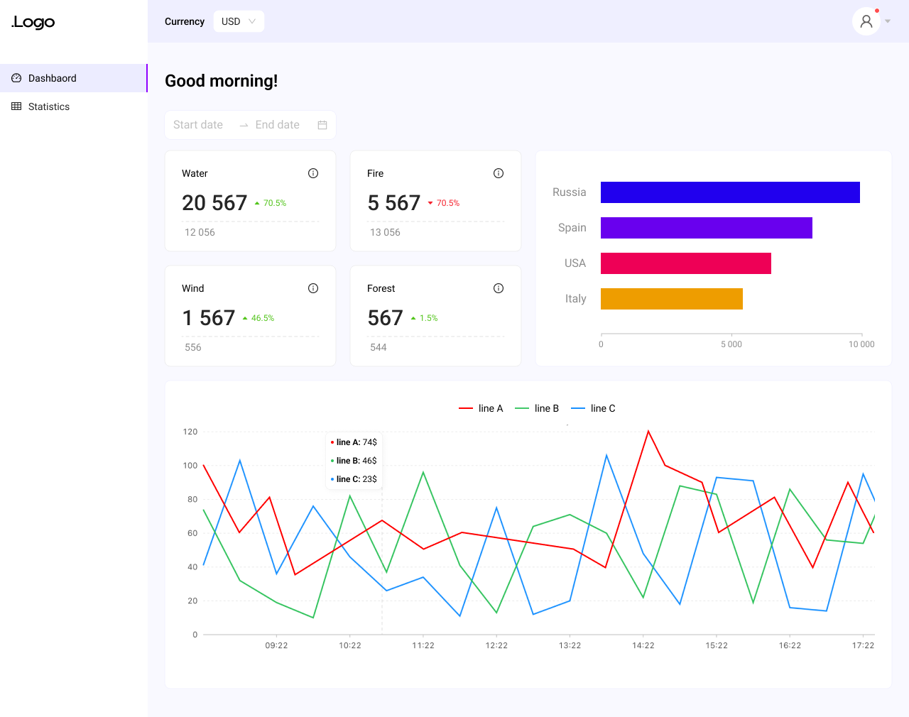
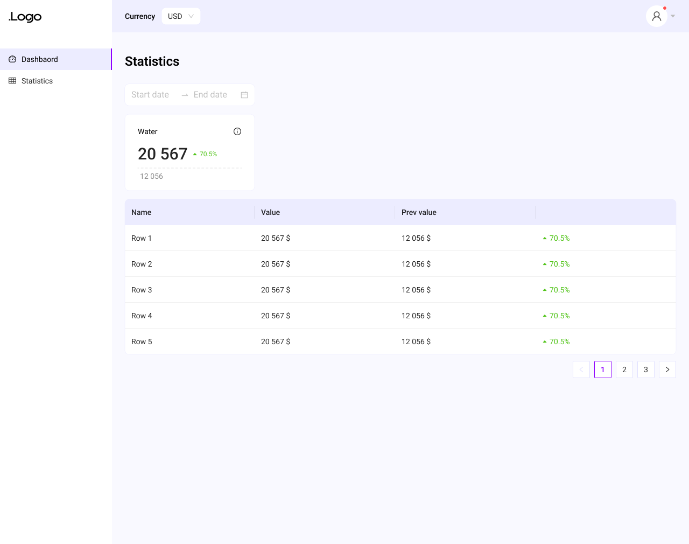

# 📈 Dashboard App

AVASoft Test Dashboard App

## 🖥 Demo

[dashboard-app.ivan-semin.com](<dashboard-app.ivan-semin.com>)

## 📦 Instalation

1. Clone repo

```bash
git clone https://github.com/IvanSemin33/dashboard-app.git
```

2. Go to app folder

```bash
cd dashboard-app
```

3. Install dependences (`node v16.16.0`, `npm v8.11.0`)

```bash
npm i
```

4. Start app

```bash
npm run start
```

## 📖 Available Scripts

In the project directory, you can run:

### `npm start`

Runs the app in the development mode.

### `npm run build`

Builds the app for production to the `build` folder.

## 📝 Technical task from AVASoft

Develop a two-page interface.

## Description of pages

### First page

Dashboard with widgets and date range selection for data. It consists of four blocks of statistics with indicators and two graphs, a regular `Linear Chart` with `Datetime Axis` and a horizontal `Bar Chart`. `RangeDatePicker` will be located above the widgets

**All data is generated randomly**. That is, you need to choose a data structure for all page widgets and write functions that will generate data for them.

When you update the dates in the calendar, you need to generate a new dataset for all widgets.

**Two values are needed for stat blocks**

1. Current value
2. Previous value

Based on these two values, calculate the difference in %, and display the indicator fell or rose, highlight the number with a percentage of green or red.

You can use any name for the blocks.

For example: `Water`, `Fire`, `Wind`, `Forest`

**Three datasets are sufficient for a line chart.**

For example: `Line A`, `Line B`, `Line C`

The `X-axis` will display the period selected in the calendar:

- at intervals of 1 hour if the period ≤ 1 day
- by days if the period > 1 day.

Note. 00:00 – 01:00 – 02:00 .... 20:00

or

29 Dec ... 10 Jan - 11 Jan - 12 Jan

**For a horizontal bar-chart, you need to display 4 countries sorted in descending order.**

For example: `Russia`, `Spain`, `United States`, `China`.

### Second page

There is also a `DateRangePicker`, one block of statistics with any indicator and a table.

For the table, we also generate random data of 15 rows.

For example: `Row 1`, `Row 2` ... `Row 15`

The table should have 4 columns

1. Name for the row `Row 1`
2. Numeric value 1, previous value, compare with it
3. Numeric value 2, the main value, we compare it
4. The difference in percentage, with the number highlighted in green or red, depending on whether the indicator is falling or growing.

All numerical values for graphs and tables will be money. In the header of the site there will be a `Select` currency switch. Depending on the chosen currency, you need to substitute its sign for all numbers (*in charts and tables*).

There will be two currencies, dollar `$` and euro `€`

### Technical requirements

1. Use React. Typescript if possible.
2. Use CSS in JS for styling (e.g. [Emotion](https://emotion.sh/docs/introduction))
3. Use the Router, you can write any or even write your own.
4. Use the [Ant Design] component library (<https://ant.design/>). For a table, `Select`, `DatePicker` or whatever.
5. Use the global state manager to switch currencies, any of your choice. If you don't know which one, take [Mobx](https://mobx.js.org/README.html)
6. Graphs, you can use any library. If you don't know which one, take [Highcharts](https://www.highcharts.com/)
7. Try to do everything in accordance with the design, text, indents, colors, etc.

Upload the result to Github, Gitlab, Bitbucket or send it as an archive

### Checklist for self-examination of TK

- Used by React
- CSS-in-JS approach is used for styling. For example `styled-components`, `Emotion`
- The `Ant Design` library is used
- You use a routing library or write your own router that works with the `Browser History API`.
- The global state manager is used to switch currencies. For example `Redux`, `Mobx`, `Effector`, `Mobx-state-tree`.
- Everything is done in accordance with the layout

### Figma
  


